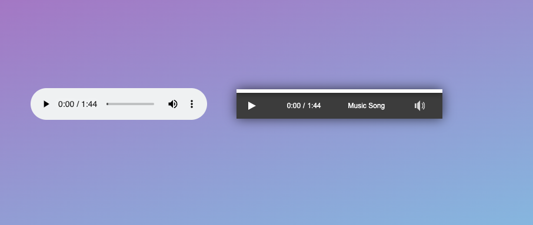
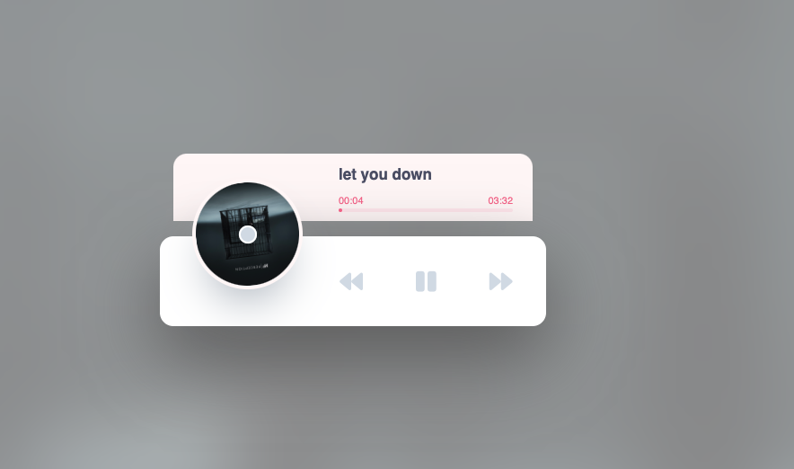

# Audio Player with HTML and CSS
This code provides an example of how to create an audio player using HTML and CSS. It uses the audio element in HTML5 to load an MP3 file and allows users to play, pause, and adjust the volume of the audio file.

# Demo
Here's a demo of the audio player in action:

# How to Use
To use the audio player, simply embed the code into an HTML file, replace the src attribute in the source element with the URL of your MP3 file, and adjust the name attribute to match the name of your audio file.

```html

<audio controls>
  <source src="https://example.com/audio.mp3" type="audio/mp3">
</audio>
<div class="audio-player">
  <div class="timeline">
    <div class="progress"></div>
  </div>
  <div class="controls">
    <div class="play-container">
      <div class="toggle-play play">
    </div>
    </div>
    <div class="time">
      <div class="current">0:00</div>
      <div class="divider">/</div>
      <div class="length"></div>
    </div>
    <div class="name">Audio File Name</div>
    <div class="volume-container">
      <div class="volume-button">
        <div class="volume icono-volumeMedium"></div>
      </div>
      
      <div class="volume-slider">
        <div class="volume-percentage"></div>
      </div>
    </div>
  </div>
</div>

```
## Screenshots
### Demo 'demo1.html'


### Demo 'demo2.html'


# Styling
The audio player is styled using CSS. You can customize the look of the player by modifying the CSS.

# Credits
The icon used for the volume button is from fontawesome.

# License
This code is licensed under the MIT License.


## 🚀 About Me
Hello, my name is [Md Rasheduzzaman](https://github.com/jmrashed). I am a seasoned Full-Stack Developer, Software Architect, and System Analyst with over six years of experience in the field. I hold a B.Sc degree in Computer Science and Engineering.

My area of expertise includes PHP, JavaScript, and Python. Throughout my career, I have developed a strong understanding of web development, including front-end and back-end programming, database management, and web architecture design. I enjoy working on challenging projects that allow me to push my skills to the limit.

As a full-stack developer, I am comfortable working with both the client-side and server-side of web development, which enables me to build web applications that are both functional and aesthetically pleasing. My experience as a software architect and system analyst has also helped me to understand the importance of designing scalable and maintainable software systems.

In my free time, I enjoy learning about new web technologies and experimenting with new programming languages. I believe that keeping up with the latest trends and technologies is essential for staying relevant and delivering top-quality work.
